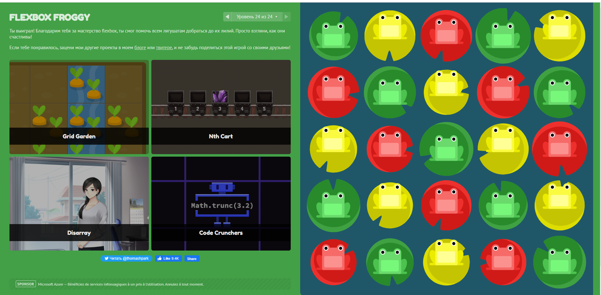
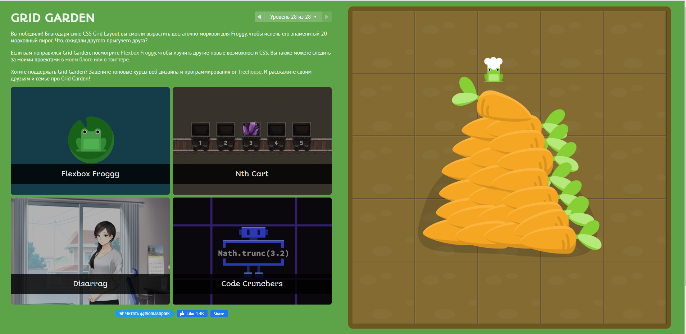

## Linux CLI, and HTTP
 

      
      
      
      
  

  
  
## Git Collaboration

      
      
      
      
      
      

## Intro to HTML and CSS

      
      
      
      
  

  ## Responsive Web Design
  

      
      
  
